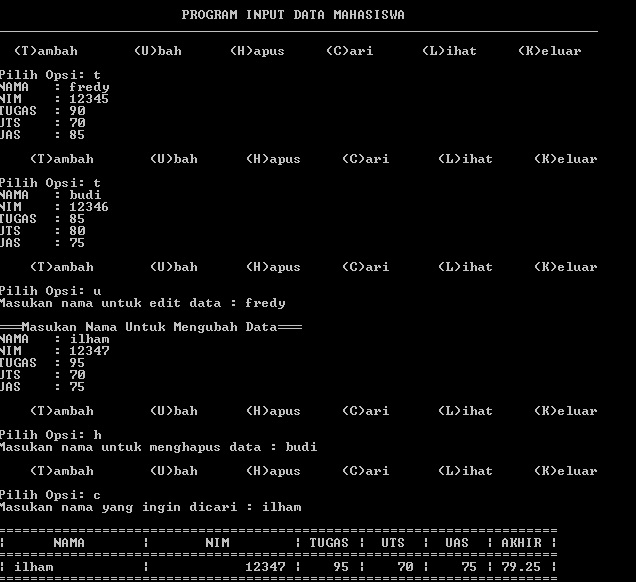
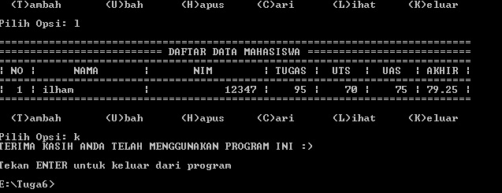

# 
Penjelasan Package dan Module Tugas 6

1. (main.py) berisi program utama untuk memanggil semua module program yang
2. Folder (model) yang didalamnya terdapat file (daftar_nilai.py) dan berisi modul 
   tambah data, ubah data, cari data, hapus data, lihat data dan keluar program 
3. Folder (view) yang didalamnya terdapat file (view_nilai.py dan input_nilai.py)
   a. (view_nilai.py) berisi modul untuk mencetak daftar nilai dan hasil pencarian
   b. (input_nilai.py) berisi modul untuk meminta user untuk menginputkan data.

   
